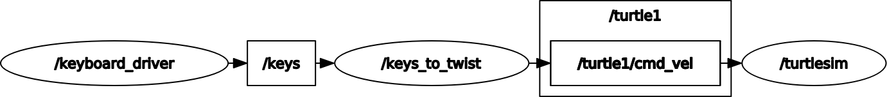
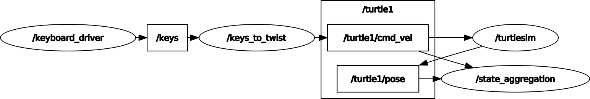
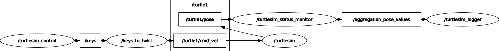

# Autonomous System: Perception 1st Exercise

- [Autonomous System: Perception 1st Exercise](#autonomous-system-perception-1st-exercise)
  - [Task 1](#task-1)
    - [Implementation of turtlesim](#implementation-of-turtlesim)
      - [Computation Graph](#computation-graph)
      - [Motion over keyboard](#motion-over-keyboard)
  - [Task 2](#task-2)
      - [Computation graph](#computation-graph-1)
  - [Task 4](#task-4)

## Task 1

### Implementation of turtlesim

#### Computation Graph

#### Motion over keyboard
The turtlesim can be controlled over following keys:
- w -> Forward
- a -> left rotation
- s -> break
- d -> right rotation
- x -> reverse
  
## Task 2
#### Computation graph

## Task 4
