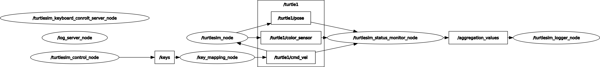
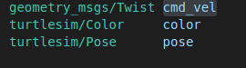

# Autonomous System: Perception 1st Exercise Turtlesim

- [Autonomous System: Perception 1st Exercise Turtlesim](#autonomous-system-perception-1st-exercise-turtlesim)
  - [Computation Graph](#computation-graph)
  - [Task 1](#task-1)
    - [Motion over keyboard:](#motion-over-keyboard)
  - [Task 2](#task-2)
    - [Aggregation:](#aggregation)
  - [Task 3](#task-3)
    - [Creation of custom messages for turtlesim state:](#creation-of-custom-messages-for-turtlesim-state)
  - [Task 4](#task-4)
    - [Logging](#logging)
  - [Task 5](#task-5)
    - [Logging service](#logging-service)
  - [Task 6](#task-6)
    - [Turtlesim control service](#turtlesim-control-service)

## Computation Graph

## Task 1

### Motion over keyboard:
The turtlesim can be controlled over following keys:
- w -> Forward
- a -> counter clockwise rotation
- s -> break
- d -> clockwise rotation
- x -> reverse
  
## Task 2
### Aggregation:
The <b>turtlesim_status_monitor_node</b> is subscriped to the following topics:
- /turtle1/pose
- /turtle1/color_sensor
- /turtle1/cmd_vel

## Task 3
### Creation of custom messages for turtlesim state:
I created a custom message in the msg folder named <b>"Aggregation.msg"</b> which contains the following message types:

and is publishing the custom message via the topic: <b>/aggregation_values</b>

## Task 4
### Logging
The <b>/turtlesim_logger_node</b> takes this custom message which includes the whole state of the turtlesim and logs it, which is relative to the package_path/Docs/Logs/logfile.json 

## Task 5
### Logging service
The logging frequency can be adjusted in the package_path/config/params.yaml file there is a parameter which is called <b>log_interval</b> and takes an double which represents the seconds.
Responsible for this is the <b>/log_server_node</b>

## Task 6
### Turtlesim control service
The control service can disable or enable the keyboard movement of the turtlesim via the package_path/config/params.yaml file. There is a parameter <b>turtlesim_keyboard_control</b> which takes a bool value. Responsible for this is the <b>/turtlesim_keyboard_control_server_node</b>.
The keyboard control can only be change at startup.